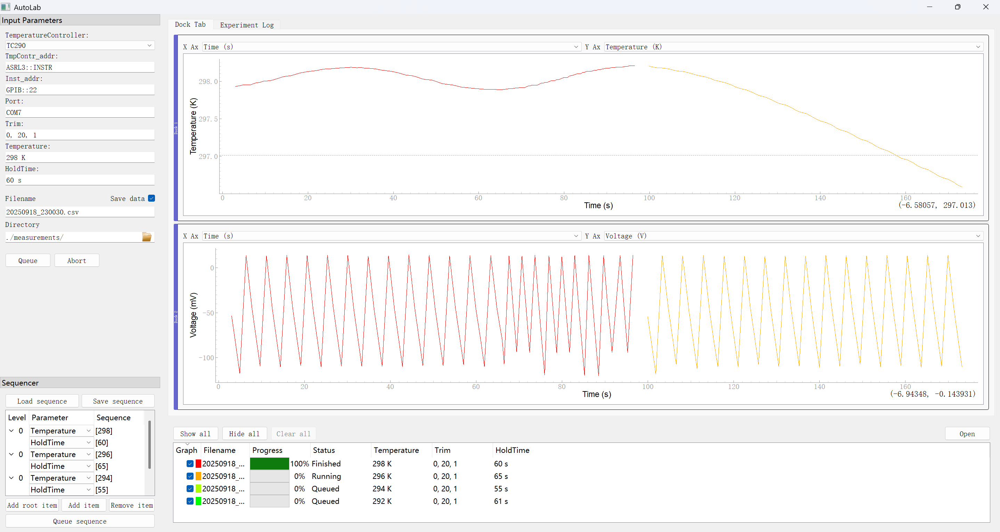

# AutoLab: Automated Measurement System

 

AutoLab is an automated measurement system built with Python and the [Pymeasure](https://pymeasure.readthedocs.io/en/latest/) library. It is designed to simplify and automate the experimental workflow for characterizing physical properties of materials, such as voltage-temperature dependence. The system provides a unified graphical user interface (GUI) to control multiple instruments, execute pre-defined experimental sequences, and log data automatically.

## ✨ Features

- **Graphical User Interface (GUI)**: Built with PyMeasure and PyQt for a user-friendly experience, featuring real-time plotting of experimental data.
- **Multi-Instrument Control**: Simultaneously controls temperature controllers (e.g., TC290, Tmon8), a Keithley 2182 Nanovoltmeter, and custom devices via serial communication.
- **Automated Experiment Sequencing**: Define a series of setpoints (e.g., different temperatures and hold times) in a simple text file (`sequence.txt`) for unattended, automated measurements.
- **Flexible Configuration**: Easily configure instrument addresses, communication ports, and other experimental parameters through the GUI or in the code.
- **Automatic Data Logging**: Experimental data (time, temperature, voltage, etc.) is automatically saved to `.csv` files for easy post-processing and analysis.
- **Extensible**: The modular code structure makes it straightforward to add support for new instruments or measurement procedures.

## 🛠️ Getting Started

Before running the project, ensure you have the necessary Python libraries and hardware drivers installed.

### 1. Prerequisites

- **Python**: Python 3.11 or higher is recommended.
- **Hardware Drivers**:
  - **NI-VISA**: To communicate with instruments via GPIB or ASRL (VISA Serial), you must install the [NI-VISA](https://www.ni.com/en-us/support/downloads/drivers/download.ni-visa.html) driver.
  - **Serial Port Drivers**: If you are using a USB-to-Serial adapter, ensure the appropriate drivers (e.g., CH340, FTDI) are installed.

### 2. Installation

Clone this repository and install the required Python packages using `pip`:

```bash
git clone <your-repository-url>
cd AutoLab
pip install pymeasure pyvisa pyqt5 pyserial
```

## 🚀 Usage

### 1. Connect Hardware

- Connect the temperature controller, Keithley 2182 nanovoltmeter, and the serial device to your computer.
- Use a tool like NI MAX to identify and note the VISA address for each instrument (e.g., `GPIB::1`, `ASRL5::INSTR`) and the COM port for the serial device (e.g., `COM4`).

### 2. Configure Parameters

- **Instrument Addresses**: Open `app.py` and modify the default values for the parameters in the `OverallProcedure` class to match your setup:
  
  - `addr_tempContr`: The VISA address of your temperature controller.
  - `addr_2182`: The VISA address of the Keithley 2182.
  - `addr_port`: The port name of your serial device.
- **Experiment Sequence (Optional)**:
  - Edit the `sequence.txt` file to define your automated measurement sequence.
  - The format consists of one parameter sequence per line:
    ```
    - "Temperature", "[270, 250, 210, 150, 77]"
    - "Hold Time", "[10, 15, 5, 10, 20]"
    ```
    This sequence will run 5 experiments: the first at 270 K with a 10s hold time, the second at 250 K with a 15s hold time, and so on.

### 3. Run the Application

Navigate to the project directory in your terminal and run the main script:

```bash
python app.py
```

### 4. Operating the GUI

1.  In the **Procedure Inputs** panel on the left, verify or update the instrument addresses and other settings.
2.  In the **Sequencer** panel, you can load, edit, or clear the experiment sequence.
3.  Click the **Browse** button to set the desired path and filename for the output data file.
4.  Click the **Queue** button to add the configured experiment to the run queue.
5.  Click the **Run** button to start the measurement.
6.  The plot windows on the right will display real-time data for temperature and voltage versus time.
7.  Upon completion, the data will be saved to the specified `.csv` file.

## 📁 Project Structure

```
AutoLab/
├── app.py                      # Main application script with procedure and GUI logic
├── sequence.txt                # Default experiment sequence configuration file
├── OverallProcedure_dock_layout.json # GUI dock layout configuration
├── measurements/               # Default directory for measurement data (create if needed)
└── README.md                   # This README file
```

## 🤝 Contributing

Contributions are welcome! If you have suggestions for improvements or want to add new features, please feel free to:

1.  Fork the repository
2.  Create your feature branch
3.  Commit your changes
4.  Push to the branch
5.  Open a Pull Request

## 📄 License

This project is licensed under the MIT License. See the [LICENSE](LICENSE) file for details.
